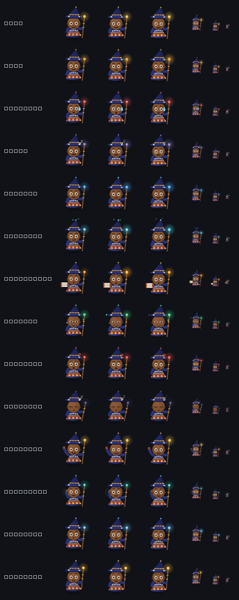

# Little Wizard

A small animated wizard who floats just above the Windows taskbar, with a tray
icon, global hotkeys, clipboard history, quick notes and countdown reminders.
He shows you what your machine and your Claude Code sessions are doing, and he
answers questions about whatever is on your screen.



> **This app used to be called Lutin.** The rename moved its data folder from
> `%APPDATA%\Lutin` to `%APPDATA%\LittleWizard`, so the first start after
> upgrading **copies** your settings, notes, clipboard history and saved avatar
> position across and tells you it did. The old folder is left exactly as it
> was — delete it yourself once you are satisfied. If you had the Claude Code
> hooks installed, they still point at the old script name: the tray menu
> offers *Réinstaller les hooks Claude Code…* to fix that, and says so on
> startup.

## Requirements

- Windows 10 or 11
- Python 3.11+ (tested on 3.14)
- PySide6 — the only runtime dependency (plus `claude-agent-sdk` for the Claude
  features and `pygments` for code highlighting)

Optional extras, each of which the app starts fine without:

| Extra | Brings | Needed for |
|---|---|---|
| `[voice]` | Windows on-device speech bindings (~5 MB, no model download) | talking to Claude, dictation, spoken answers |
| `[live]` | `sounddevice` | transcribing system audio during a meeting |
| `[ocr]` | Windows OCR bindings | copying text out of a screen region locally |

## Install

```powershell
py -3.14 -m venv .venv
.venv\Scripts\python.exe -m pip install -e ".[dev]"
powershell -ExecutionPolicy Bypass -File scripts\shortcut.ps1
```

The last line puts a **Little Wizard** icon on the Desktop and in the Start
Menu. Double-click it to launch — that is the whole story from then on. To keep
it one click away, right-click the Start Menu entry → *More* → *Pin to taskbar*.

`scripts\shortcut.ps1 -Remove` deletes both shortcuts again;
`-DesktopOnly` skips the Start Menu entry.

The shortcut points at `.venv\Scripts\wizard.exe`, the GUI launcher that
`pip install -e .` generates from the `[project.gui-scripts]` entry point. It is
a GUI-subsystem binary, so no console window ever appears. If you prefer the
command line, `.venv\Scripts\pythonw.exe -m wizard` does the same thing.

> **The shortcut hard-codes this folder.** Move or rename the project and the
> icon breaks — just re-run `scripts\shortcut.ps1` to point it at the new path.

> **Windows 10 hides new tray icons.** On first run the wizard's tray icon goes
> into the overflow area behind the `^` chevron. Drag it onto the taskbar, or
> use *Taskbar settings → Select which icons appear on the taskbar*, to keep it
> visible.

## What it does

> **The interface is in French; the code is in English.** Identifiers, comments,
> docstrings and this README stay English, as does anything the user never sees
> (the `Mood` values, config keys, hotkey modifier names). Everything displayed —
> menus, dialogs, notifications, the comments inside `config.default.toml` — is
> French. Strings are inline rather than routed through Qt's `tr()`, because the
> app targets one language and a `.ts`/`.qm` pipeline would be pure ceremony.

| Action | Hotkey | Menu entry |
|---|---|---|
| Ask Claude | `Ctrl+Alt+C` | *Demander à Claude…* |
| Show a screen region | `Ctrl+Alt+S` | *Montrer une zone…* |
| Show the whole active screen | `Ctrl+Alt+E` | — |
| Act on the selected text (translate, fix, summarise…) | `Ctrl+Alt+T` | — |
| Copy the text in a screen region (local OCR) | `Ctrl+Alt+O` | — |
| Launch a background agent | — | *Lancer un agent…* |
| Conversation history | — | *Historique des discussions…* |
| Show a window | `Ctrl`+drag the avatar onto it | — |
| Show an image | drop the file on the avatar | — |
| Quick note | `Ctrl+Alt+N` | *Note rapide* |
| Clipboard history | `Ctrl+Alt+V` | *Presse-papiers* (or a single tray click) |
| Command palette | `Ctrl+Alt+Space` | *Lancer* |
| Show / hide the avatar | `Ctrl+Alt+A` | *Masquer / Afficher le sorcier* |
| Reminders | — | *Me rappeler…* |

- **The command palette** (`Ctrl+Alt+Space`) searches actions, launcher entries,
  notes and clipboard history together, so you never have to remember which menu
  a thing lives in. Fuzzy, accent-insensitive (`reunion` finds *Réunion*), and
  entirely keyboard-driven.
- **Left-click the avatar** opens the full action menu; **drag it** to move it
  anywhere, and it remembers where you left it.
- **Clipboard history** records text copies into SQLite, skipping blanks and
  consecutive duplicates, pruned to `max_entries`. Select an entry and press
  Enter to put it back on the clipboard.
- **Moods** come from CPU, RAM and battery: calm → busy → stressed, plus a
  tired face when you are below `battery_low` on battery power. A mood that
  comes from Claude — a session working, or waiting for your answer — outranks
  the machine's, because one needs you and the other is just weather.
- **The staff is the status light.** Its colour and its pulse are the state
  indicator, rather than a badge stuck to the side of the character: gold at
  rest, blue while Claude works, bright amber pulsing when something is waiting
  on you. He also dozes off after three minutes of nothing, and wakes when you
  come near.
- **Reminders** accept `25`, `25m`, `1h30`, `90s` or `25:00`, with presets
  including a 25-minute pomodoro.
- **Captures** are downscaled to a 1568px long edge (past that Claude
  downsamples anyway) and always shown in a confirmation dialog before they can
  be used. Plain drag still moves the avatar; `Ctrl`+drag is what points at a
  window, so neither gesture shadows the other.

- **Claude** answers in the wizard, never in a terminal. The conversation is one
  long-lived connection rather than a fresh CLI per question, so asking twice
  costs one startup, not two. Confirming a capture
  opens the question panel; the answer streams back in place. The conversation
  persists (the SDK's `resume`) until *Nouvelle discussion Claude*.
- **Approvals** appear on the avatar with Autoriser / Toujours / Refuser, for
  both the sessions Little Wizard starts and the ones you run yourself. Not answering
  denies: silence is not consent.
- **Your own Claude Code sessions** show up too, once the hooks are installed:
  what each one is reading, editing and running, one coloured avatar per
  session.

## Claude Code hooks

*Installer les hooks Claude Code…* in the tray menu adds Little Wizard to
`~/.claude/settings.json` so your own sessions show up in the avatar and their
permission prompts can be answered there. Before writing anything it backs the
file up with a timestamp, **merges** rather than replaces, and shows you the
exact diff. Uninstalling removes only Little Wizard's entries.

The rule that governs the whole bridge: **a Claude Code session is never
blocked by Little Wizard.** Observational events are registered with `"async": true`,
so they cannot delay a session at all. Only `PermissionRequest` waits, and
every failure path in the hook exits 0 with no output, which leaves the normal
permission flow untouched. Measured with the app stopped: the hook returns in
about 0.6s having rendered no decision, and the terminal asks you as usual.

Hooks run in exec form (`command` + `args`) pointing at `pythonw.exe`, a real
executable, so no shell is spawned per tool call and no console window appears.

## Requirements for the Claude features

Claude Code must be logged in on this machine:

```powershell
claude auth status    # "loggedIn": true
claude auth login     # if not
```

Little Wizard uses your existing subscription through the Agent SDK. There is no API
key to obtain and nothing billed on top.

**The connection opens at startup**, in the background, so the first question
does not wait for it (`claude.prewarm`, on by default). The staff carries the
result: lit in its usual colour when the link is up, a slow pale pulse while it
is connecting, and drained grey when it is not. The tray tooltip and menu say
why.

> **A missing login does not announce itself at connection time.** The CLI
> starts and the handshake succeeds; only the first real question comes back
> with *"OAuth session expired and could not be refreshed"*. So the connection
> state follows the first turn's verdict rather than the handshake's, and
> Little Wizard shows you the `claude auth login` instruction instead of the raw
> English error. It then stops retrying, because retrying cannot log anyone in —
> asking again after you have logged in reconnects immediately.

Other failures (a dropped pipe, a killed CLI) do retry, backing off 1, 2, 4 …
up to 60 seconds.

## Configuration

Edit `%APPDATA%\LittleWizard\config.toml` (created on first run from
`src/wizard/config.default.toml`), then pick **Recharger la configuration** in the tray menu.
No restart needed, hotkeys included.

Launcher entries take anything the Run dialog accepts — an executable, a
document, a folder, a `shell:` moniker or a URL:

```toml
[[launcher]]
label = "Project"
target = "code"
args = ["C:\\Users\\me\\projects\\thing"]

[[launcher]]
label = "Downloads"
target = "shell:Downloads"
```

A malformed file never blocks startup: bad values fall back to defaults and the
app reports what it ignored in a tray notification.

## Data and privacy

What is stored, all of it on your machine, in `%APPDATA%\LittleWizard\`:

- `config.toml` — your settings
- `wizard.db` — notes, clipboard history, and the history of your
  conversations with Claude (SQLite): questions, answers, the actions you
  allowed or refused, and a **256 px thumbnail** of each capture — never the
  full image. Turn it off with `history.enabled = false`, purge it by age with
  `history.retention_days`, or wipe it with *Tout effacer…* in the History
  window.
- `state.ini` — the avatar's last position
- `memory.md` — what you asked Claude to remember about you, if you wrote one

`%APPDATA%\Lutin\` may also still exist: it is the pre-rename folder, kept as a
backup, plus a `.migrated-to-LittleWizard` marker. Nothing reads it after the
first start.

**What leaves your machine.** Asking Claude sends your question and, when you
attach one, the capture — to Anthropic, through the Claude Code CLI you are
already signed in to. That is the whole point of the feature, and it is the only
network traffic this app causes: there is no telemetry, no analytics and no
other endpoint. Three more things are sent, each only because you asked:

- **`memory.md`**, with every question, if you wrote one.
- **The selected text**, when you use an action on a selection.
- **A background agent's task** and whatever it reads in the folder you gave it.

Local OCR sends nothing. Two guarantees around captures:

- **No capture is ever sent without you seeing it first**, in a confirmation
  window that shows exactly the image that will go. There is deliberately no
  setting to skip it.
- **Nothing is captured in the background.** Every capture starts from an action
  you took.

Since clipboard history captures whatever you copy — passwords included — turn
**Enregistrer le presse-papiers** off in the tray menu before copying secrets, or
set `clipboard.enabled = false`. **Copied images are kept too** (screenshots
included) — `clipboard.images = false` stops that while keeping text. A
screenshot carries the same risk over a wider
area: displayed passwords, private messages, client data. Check the preview.

The History window's *Mes sessions Claude Code* view **reads** the transcripts
in `~/.claude/projects` when you open it, and never writes to them. Nothing
from them is copied into `wizard.db`.

**Headless mode listens locally.** `--headless` (the core for the Tauri UI
being built, see below) opens a WebSocket on `127.0.0.1` only, on a random port.
It is not reachable from the network, and since any web page open in a browser
on this machine *could* reach it, every connection must present a secret token
within two seconds, and connections from a web origin other than our own UI's
are refused. The token is handed over by the process that launched the core and
removed from its environment at once, so Claude Code, agents and launched apps
never inherit it. It is never logged. The default (Qt) mode opens no socket.

*Lancer au démarrage de Windows* writes one `HKCU\...\CurrentVersion\Run` value
and removes it when you untick it. The first start after the rename also removes
the old `Lutin` value and writes the new one in its place, so autostart keeps
working. Nothing else touches the registry.

## Tests

```powershell
.venv\Scripts\python.exe -m pytest
```

The suite covers the logic that is worth protecting and does not need a
display: config parsing and clamping, SQLite behaviour (dedup, pruning, LIKE
escaping), the mood thresholds, the hotkey/duration parsers, image sizing,
the hook framing and settings.json surgery, and the rename migration.

The protocol shared with the Tauri UI is tested from both sides, against the
same fixtures (`tests/protocol_fixtures.json`):

```powershell
cd ui
npm install
npm run check      # tsc --noEmit, then Vitest
```

## Assistant features

**Actions on the selected text** (`Ctrl+Alt+T`) — in any application: pick
*Traduire en anglais / en français, Reformuler, Corriger, Résumer* or
*Expliquer*. The result opens in a small window, editable, with *Remplacer la
sélection* (pasted back into the app it came from) or *Copier*. There is no API
for another app's selection, so it does what a person would — Ctrl+C, then
Ctrl+V — with three precautions: it waits for you to release the shortcut's
keys (Ctrl+C sent while Ctrl+Alt are still down is Ctrl+Alt+C, this app's own
"ask Claude" shortcut); it watches the clipboard's sequence number rather than
its text, so a selection identical to what was already copied is still seen;
and it snapshots every clipboard format and **puts your clipboard back**
afterwards, rich text and images included, without any of it landing in the
clipboard history. The job runs as its own one-question Claude session **with
no tools**: selected text can be someone else's email containing instructions,
and a job that can only return text cannot be talked into anything else. It
never touches the conversation in the answer panel.

**Background agents** (*Lancer un agent…*) — a task and a folder; the agent
works in its own Claude Code session, every action still goes through the
approval card (the card says which agent is asking), and a toast reports when
it is done. At most three run at once. Each one — and each of your own Claude
Code sessions seen through the hooks — gets a **mini-wizard** beside the main
one, in the pose of its state (working, waiting for you, done, failed), ringed
in its colour; hover for its last actions, click to read the report or stop it.
They are drawn once per change, never animated, so they cost nothing at rest.

**Memory** (*Paramètres → Mémoire*) — a `memory.md` in the config folder,
added to Claude's instructions: how you like to be answered, what you work on.
Capped at 6,000 characters in what is sent (the file itself is never cut), and
HTML comments are not sent.

**Copy the text in a region** (`Ctrl+Alt+O`) — Windows' own OCR, on the
machine: nothing is sent, nothing is billed. French and English here. The
region is read at full resolution (the downscale meant for Claude would blur
small interface text) and doubled when small. One trap worth recording: called
on the GUI thread, the WinRT calls **deadlock** — Qt makes that thread a COM
single-threaded apartment, WinRT delivers completions there as window messages,
and nothing pumps them. They always run on a thread of their own.

**Reminders in plain words** — type *rappelle-moi dans 20 minutes d'appeler
Koffi* in the command palette and it becomes the top suggestion; *dans une
heure et demie*, *dans un quart d'heure*, *à 15h30* work too. Claude can set one
with its `set_reminder` tool. Reminders still live **in memory**: closing the
app loses them, and every message that creates one says so.

**Images in the clipboard history** — copied pictures and screenshots are kept
too, with a thumbnail, and can be copied back. They are capped (2,560 px on the
long edge, 30 kept by default) because a screenshot weighs what two hundred
text clips do.

## Conversation history

*Historique des discussions…* (tray menu or command palette) lists every
conversation, grouped by day with pinned ones on top, and filters by kind.
Search is SQLite FTS5 with accent folding, so `reunion` finds *réunion*; what
you type is turned into quoted prefix terms first, so a stray quote or `OR`
is searched for rather than parsed as query syntax (raw FTS5 raises on an
unbalanced quote). Rename, pin, delete, export to Markdown — and **Reprendre**,
which reconnects with the SDK's `resume` so Claude has the old context back.

The last filter, *Mes sessions Claude Code*, reads the transcripts Claude Code
keeps in `~/.claude/projects`. Strictly read-only: those files are Claude
Code's state, and a damaged transcript can break resuming it in the terminal.
Their format is Claude Code's and changes between versions, so the reader
skips anything it does not recognise instead of failing.

**The schema is versioned now.** It used to be a `CREATE TABLE IF NOT EXISTS`
script, which works right up to the first new column: on an existing database
the create is skipped and the next query fails, on the user's machine only.
`schema.py` is a ladder of numbered migrations on `PRAGMA user_version`, each
applied once inside a transaction; a failed step leaves nothing behind, and a
database newer than the code is refused rather than touched. Verified on a
copy of a real pre-versioning database: version 0 to 3, every row identical.

## On-screen guidance

Claude can *show* things on your screen, not only describe them: an arrow at a
button, a highlighted area with the rest of the screen dimmed, or a step-by-step
walkthrough with *Précédent / Suivant*. It does this through four tools —
`point_at`, `highlight`, `show_steps`, `clear_overlay` — served in-process by an
SDK MCP server and pre-approved, since drawing an arrow cannot change anything.
When Claude points, the wizard walks over and stands beside the spot, staff
aimed at it, then goes home when the annotation clears.

The overlay is one click-through window per monitor. It never takes a click or
a key: WindowTransparentForInput *and* `WS_EX_TRANSPARENT | WS_EX_LAYERED |
WS_EX_NOACTIVATE` set explicitly, because an overlay that eats one click breaks
the app it is explaining. Verified by asking Windows which window is under the
target point — it answers with the window *beneath*. Escape clears everything:
the overlay cannot have focus, so Escape is claimed as a global hotkey **only
while something is on screen**, and released the moment it clears. Annotations
also clear themselves after `ui.overlay_seconds`, and the timer that does it
wakes once per expiry rather than polling.

**Mapping Claude's coordinates back onto the screen** is the part that has to be
exactly right. Claude reasons in pixels of the image it received, which was
cropped, grabbed at the monitor's scale factor and downscaled to 1568 px. Each
capture records the logical rectangle it covered and the final size of the
image sent; device pixels and the downscale then cancel out, and a point is a
proportion of one mapped onto the other. `overlay/mapping.py` does this and
nothing else, with tests at every stock scale factor (100–200 %), on monitors at
negative coordinates, and against the real downscaling function. The tools refuse
to draw against a dropped photo — it has no place on the screen, and a
confidently wrong arrow is worse than none.

### Keeping our windows out of the screenshots

The obvious tool, `SetWindowDisplayAffinity(WDA_EXCLUDEFROMCAPTURE)`, **does not
work on the avatar or the overlay**. Measured on Windows 10 22H2: it succeeds on
an opaque window and fails with error 8 on any translucent (layered) one — and
both of those are translucent. The avatar had been appearing in captures despite
a setting meant to prevent it.

So every capture now goes through a *cloak*: our windows are hidden, the screen
is given 80 ms to repaint, the grab happens, and they come back — even if the
grab fails. The avatar blinks out for a tenth of a second; in exchange, the
image sent to Claude is guaranteed clean. Checked with a control: a raw grab
shows a test window and the overlay's accent ring, and the same capture through
the cloak shows neither. This also fixed the window picker, which used to grab
immediately after hiding its halo, before the screen had repainted.

`ui.exclude_from_capture` therefore does something narrower, and true: it hides
the **opaque panels** — answers, command palette, approvals, settings — from
screen sharing and recording, which Windows does allow (verified: affinity
`0x11` on all four). You see them; the people watching your Teams or Zoom share
do not. **The wizard himself and the on-screen arrows cannot be hidden from
screen sharing**; they are only ever removed from the captures this app makes.

## Look and feel

One design system, in `src/wizard/design/`, holds every colour, size, radius,
font and animation duration. Before it, the same stylesheet was pasted into four
files and had drifted; now nothing outside that package names a colour.

- **Light and dark follow Windows automatically**, along with your accent
  colour.
- **The accent is checked for contrast, and nudged if it fails.** Windows' own
  default blue `#0078D7` reaches only 4.499 against white text and worse against
  black — *no* text colour passes WCAG AA on it. Rather than lower the bar or
  ignore your choice, the fill is darkened in small steps until it passes:
  `#0078D7` becomes `#0071cb`, the same blue, now readable.
- **Mica and rounded corners on Windows 11**, via `DwmSetWindowAttribute`, with
  an opaque themed fallback on Windows 10. **The Windows 11 path is written but
  unverified** — this was developed on Windows 10 22H2, where those attributes
  simply return a failure code. The fallback is the tested path.
- **Animations honour the system setting.** Everything goes through one
  `animate()` that checks `SPI_GETCLIENTAREAANIMATION` and jumps straight to the
  end state when Windows says not to animate.
- **Notifications are ours**, not tray balloons: themed, stacked above the
  avatar, dismissed on a click, paused while the pointer is over them. Approvals
  stay a real window, because a toast is something you may ignore and an
  approval is not.
- **He gets out of the way of full-screen apps.** Rather than comparing window
  rectangles — which a maximised window fools and a borderless game defeats —
  the app asks Windows through `SHQueryUserNotificationState` and hides while a
  game, a video or a presentation is running. He comes back afterwards, unless
  you had hidden him yourself first.

### Settings, and why they do not wreck your config

*Paramètres…* (tray menu or command palette) is a window over `config.toml`,
which stays the source of truth. It writes **only the keys you changed, one
line at a time**, so two things survive a save that a normal TOML serialiser
would destroy:

- **The French comments** explaining each setting. A round-trip through a
  TOML library drops every one of them; `config_writer.py` replaces just the
  value and keeps the comment in its column.
- **A hand edit made while the window was open.** Writing a full snapshot
  would silently revert it. Writing only what changed does not.

Shortcuts are captured live — click the field, press the combination — and
checked for conflicts before saving, by what they *mean* rather than how they
are spelt: `ctrl+alt+n`, `Control+Alt+N` and `alt+ctrl+n` are one shortcut, and
a text comparison would let you register the second one, which would then
silently never fire. Shift on its own is refused as a modifier, since
`shift+A` would swallow every capital A you type anywhere.

### Answers with code

While an answer streams it is one plain view, which keeps up cheaply. Once it
is complete, an answer containing code is re-rendered as separate blocks: prose
through Qt's Markdown, each code block highlighted (Pygments, with a palette
matched to the theme) and given **its own Copier button**. Rebuilding widgets
on every streamed chunk would flicker and cost far more. Code keeps its own
line breaks and scrolls sideways when long: wrapping would misrepresent
indentation, which in Python is the syntax.

### First run

A welcome screen, shown once, introduces him, lists the shortcuts worth
learning, and **checks this machine** rather than promising: whether Claude
Code is logged in, whether the hooks are installed (with a button to do it),
and where Windows 10 hides the tray icon. It stays on top, because at logon
with autostart the app is a background process, and Windows would otherwise
open it behind whatever you had in front — where it was, until that was
caught by checking which window was actually painted at its centre.

## The character

Little Wizard is a small African wizard: dark skin, big round eyes, an indigo
robe and a pointed hat banded with sober bogolan- and kente-inspired geometry,
cowrie shells, and a carved staff whose tip carries the app's state light.

He is drawn **twice over**, and the app picks whichever is available:

| Source | When | Where |
|---|---|---|
| `character/painter.py` | always — no assets needed | QPainter, resolution-independent |
| `character/sheet.py` | as soon as `assets/character/wizard_idle_1.png` exists | PNG frames, which then take over silently |

Nothing else in the app knows which one it got. `character/animation.py` owns
the clock — poses, transitions, blinking, dozing off — and hands both renderers
the same `Frame`. It imports nothing from Qt, which is why the fiddly parts (a
pose that never reverts, blinking that stops re-arming, waking up onto a mood
that changed while he slept) are covered by ordinary unit tests instead of by
looking at the screen.

To generate hand-drawn art, **`docs/ASSETS_BRIEF.md`** has the character sheet,
the exact palette, the framing rules and a ready-to-paste prompt per pose. A
partial set is fine: only `idle` is required and missing poses fall back to it.

To look at every pose at once:

```powershell
.venv\Scripts\python.exe tools\contact_sheet.py            # from code
.venv\Scripts\python.exe tools\contact_sheet.py --assets   # from assets/
```

That writes `docs/poses.png` at 96, 48, 32 and 16px, and prints which renderer
it used — which is the quickest way to find out why your PNGs are not showing
up (almost always a filename that does not match).

**Cost.** The body — gradients, clipped paths, woven bands — is rendered once
into a pixmap and reused; only the eyes, mouth, staff light and props are drawn
each frame, and the halo is a cached pixmap rather than a live radial gradient.
Drawn naively the character cost 5.3% of a core at idle; it now costs **0.7% of
one core** (0.18% of a four-core machine), measured over 40 seconds.

## The icon

`src/wizard/app.ico` is generated, not hand-drawn — it comes from the same
code as the running character:

```powershell
.venv\Scripts\python.exe tools\make_icon.py
```

Re-run it after changing the character, then re-run `scripts\shortcut.ps1` so the
shell picks up the new file. It writes nine sizes (16 to 256) because Windows
picks a different one per context, and below 32px it enlarges the eyes and
thickens the mouth — at 16px the default proportions blur into the body.

## Packaging

```powershell
.venv\Scripts\pyinstaller.exe --noconsole --onefile --name Wizard ^
  --icon src\wizard\app.ico ^
  --add-data "src\wizard\config.default.toml;wizard" ^
  --add-data "src\wizard\app.ico;wizard" ^
  --paths src ^
  src\wizard\__main__.py
```

`--icon` sets the icon baked into the .exe; the second `--add-data` ships the
same file inside the bundle so `app_icon()` still finds it at runtime for the
dialogs. Point `scripts\shortcut.ps1` at `dist\Wizard.exe` afterwards, or
just make a shortcut to it by hand — a packaged build needs no virtualenv.

## Architecture

```
src/wizard/
  branding.py       the app name and every identifier derived from it
  paths.py          where files live, and the migration from the old name
  mood.py           the eight moods, and which one wins
  sessions.py       every Claude Code session seen, internal or external
  claude/           the Agent SDK: one persistent session, permissions
  capture/          region, window and file capture
  bridge/           named pipe + settings.json hook installer
  ui_claude.py      ask panel, approval card
  ui_capture.py     the confirm-before-send preview
  ui_hooks.py       the settings.json diff
  app.ico           the app icon, generated by tools/make_icon.py
  winapi.py         ctypes wrappers: taskbar, CPU/RAM/battery, hotkeys, autostart
  config.py         TOML loading with defaults and clamping
  storage.py        SQLite: notes + clipboard history
  character/        the wizard: poses, animation engine, two renderers
  design/           tokens, theme, stylesheet, window materials, motion
  fuzzy.py          subsequence ranking for the command palette
  ui_palette.py     the command palette
  ui_toast.py       in-app notifications
  ui_settings.py    the settings window
  ui_onboarding.py  the first-run screen
  config_writer.py  edits config.toml one line at a time, keeping comments
  hotkey_spec.py    capturing a shortcut, and finding two that collide
  markdown_blocks.py  splitting an answer into prose and highlighted code
  overlay/          on-screen guidance: mapping, scene, surfaces, MCP tools
  capture/cloak.py  keeps our windows out of our own screenshots
  schema.py         numbered SQLite migrations on PRAGMA user_version
  history.py        conversations, messages, thumbnails, FTS5 search
  claude_transcripts.py  read-only access to ~/.claude/projects
  ui_history.py     the History window
  assistant/        selection actions, agents, memory, local OCR
  claude/oneshot.py one tool-less question outside the conversation
  ui_selection.py   the result window for selection actions
  ui_sessions.py    mini-wizards, one per session or agent
  ui_agent.py       launching an agent
  features/nl_reminder.py  "rappelle-moi dans 20 minutes…"
  avatar_window.py  the frameless translucent always-on-top window
  hotkeys.py        RegisterHotKey bridged into Qt via a native event filter
  tray.py           tray icon and menu
  ui.py             quick note, history panel, reminder dialog
  app.py            wiring only: who talks to whom
  presenter.py      what the app shows, as one interface
  presenter_qt.py   ...as Qt widgets (the default)
  presenter_remote.py  ...as events to the Tauri UI (--headless)
  protocol.py       the UI protocol, checked both ways
  protocol_messages.json  every message, read by Python and TypeScript
  ws_server.py      the local WebSocket: token, origin, size cap
  screens.py        desktop coordinates <-> (screen id, position)
  features/         launcher, clipboard watcher, monitor, timers
hooks/
  wizard_hook.py    the hook handler Claude Code spawns (stdlib only)
scripts/
  shortcut.ps1      creates/removes the Desktop and Start Menu shortcuts
ui/                 the Tauri UI (phase M1: the typed protocol only)
tools/
  make_icon.py      renders the character into a multi-resolution app.ico
  contact_sheet.py  renders every pose to docs/poses.png, to look at them
assets/character/   hand-drawn frames, if you have any (see docs/ASSETS_BRIEF.md)
PLAN.md             the plan this app is being built out against
DESIGN.md           the design of the Tauri UI
```

Decisions worth knowing about:

- **Placement uses Qt, not Win32.** `QScreen.availableGeometry()` already
  reports the area the taskbar left free, in logical pixels and DPI-correct.
  `SHAppBarMessage` is only consulted for the auto-hide flag, which Qt does not
  expose.
- **Global hotkeys need a native event filter.** `RegisterHotKey` posts
  `WM_HOTKEY` to a window's message queue, and Qt owns that queue, so
  `QAbstractNativeEventFilter` is the supported place to intercept it. A
  never-shown widget owns the registrations so hotkeys survive hiding the
  avatar.
- **Two permission paths, one panel.** Sessions Little Wizard starts are gated by the
  SDK's `can_use_tool` callback; sessions you start are gated by the hook. Both
  end up in the same approval card, and the hook skips sessions Little Wizard started
  (`WIZARD_OWN_SESSION`) so nothing is asked twice.
- **The bridge is a named pipe.** `QLocalServer` is one on Windows, which is
  the exact equivalent of the Unix socket coucou uses, and it already lives in
  the Qt event loop.

## Headless core (Tauri UI, in progress)

The Qt windows are being replaced by a Tauri 2 UI (PLAN.md, *Migration UI*).
The Python code stays, as a core with no window, and talks to the UI over a
local WebSocket. Phase M1 is the core side:

```powershell
$env:WIZARD_UI_TOKEN = "<a long random secret>"
.venv\Scripts\python.exe -m wizard --headless
# WIZARD_READY {"port": 51234, "pid": 9796}
```

It creates no visible window: hotkeys, captures, Claude, the hook bridge and
the database all run as before, and everything they would have shown becomes
an event on the socket. Without `WIZARD_UI_TOKEN`, a token is generated and
printed on that ready line, for a manual run. Exit codes: 3 if the app is
already running, 4 if the socket cannot listen.

- **One protocol, one file.** `src/wizard/protocol_messages.json` lists every
  message; `protocol.py` and `ui/src/protocol.ts` both read it, and the
  TypeScript types do not compile if they drift from it.
- **One seam.** `app.py` never touches a widget: it talks to a *presenter*,
  either `QtPresenter` (today's windows, still the default) or
  `ProtocolPresenter` (the socket).
- **The promises hold without the UI.** An approval nobody answers is denied
  at its timeout by the core itself. A capture reaches Claude only after a
  `capture.confirm` naming the exact capture the UI was shown. Before a grab,
  every UI window must confirm it is hidden (`cloak.hide` → `cloak.ack`); one
  that does not answer within 600 ms cancels the capture rather than let our
  own windows into it.
- **Coordinates** go out as a screen id (`\\.\DISPLAY1`, the name Qt and Tauri
  both use) plus logical pixels from that screen's corner (`screens.py`).

Measured on the real Windows platform: no visible window, a screen capture
through the cloak handshake in 0.35 s, 0.08 % of one core idle with a UI
connected (60 s), and a clean exit in 0.3 s on the `quit` action.

Not in headless mode yet: the settings, history, quick note, palette,
onboarding and hook-diff windows. Asked for, they become a `window.open` event,
and nothing is written meanwhile (installing the hooks needs the diff shown
first). They come back in phase M6 bis.

### The Tauri shell (phase M2)

`ui/src-tauri` is the Tauri 2 application: it starts the core, keeps it
alive, and opens the windows. It needs Rust (`rustup`, MSVC toolchain) and
Node:

```powershell
cd ui
npm install
npm run tauri dev     # Vite dev server + the Rust shell, which starts the core
```

The windows are placeholders for now (a coloured disc for the avatar, the raw
events in the panel, a marker in the overlay); the real ones are phases M4–M6.

- **The core** is started as `python -m wizard --headless
  --exit-on-stdin-close`, from the repository's `.venv` (or `WIZARD_CORE`). It
  is restarted if it dies, after 1, 2, 4, 8, 16 s, and given up on after five
  crashes within a minute; exit code 3 (already running) is never retried.
- **Stopping it** never kills what it launched for you: Tauri closes the
  core's stdin, which is the signal to quit, and that also happens by itself
  if Tauri crashes. Only a core still there after 10 s is killed, and then only
  the interpreter, so an editor opened from the launcher stays open. A
  kill-on-close job object was ruled out for that reason.
- **The token** is generated by Tauri, given to the core in its environment,
  and to the windows through a Tauri command: it never appears in a URL or in
  a log.
- **Windows**: an avatar of 72 px that never takes the focus; a panel above
  it; one click-through overlay per screen, realigned to the monitors each
  time the guide draws.
- **Screen sharing**: `WDA_EXCLUDEFROMCAPTURE` is **accepted on all three**
  WebView2 windows, overlay included, where Qt was refused it on every
  translucent window. The order matters: the overlay gets it before being made
  click-through, which makes it layered, and keeps it afterwards.

Measured on this machine: the core ready 2.3–9.6 s after launch; after a
simulated crash of the core, the windows reconnected to its new port; after a
simulated crash of Tauri, the core left on its own in 6–7 s. **Memory: about
550 MB in all**, of which ~240 MB for WebView2 (9 processes), ~145 MB for the
Python processes and ~135 MB for the Claude Code process. **Idle CPU: 4.2–4.4 %
of one core in all** (two 100 s windows, production frontend): the core 0.08 %,
the Tauri shell 0.03 %, WebView2 1.8 %, Claude Code 2.2–2.5 %. WebView2's share
is with placeholder pages that redraw their event log on every message; the
budget is worked on in phase M4.

### The playground (phase M3)

```powershell
cd ui
npm run playground    # opens http://127.0.0.1:5173/playground.html
```

The real window views, fed by a fake core that replays a scenario
(`ui/src/playground/scenarios/*.json`: a streamed answer, an approval running
out, a capture through the cloak, the guide on two screens, a core crash). No
Python, no Tauri: this is where the look is worked on. Only the socket is
fake: each window keeps its real connection code, reconnection and cloak
included, and every scenario is checked against the protocol by the tests.

## Known limits

- Windows only. The modules import cleanly elsewhere (the Win32 calls degrade to
  neutral values) so the tests run anywhere, but the app itself does not.
- Reminders live in memory: they do not survive a restart, by design.
- Clipboard history is text only — images and files are ignored.
- The avatar is always-on-top, so it can cover a corner of a window underneath.
  Drag it somewhere else, or hide it with `Ctrl+Alt+A`.
- **Packaging does not currently work on this machine.** PyInstaller has no
  wheel for Python 3.14, so the command in *Packaging* above cannot run until
  either PyInstaller ships one or you build the app on 3.12/3.13. The command
  itself is correct; it is the tool that is missing.
- There is no CI. The tests and the linter are run by hand.
- **Idle CPU is about 1 % of one core for the app's own process**, measured
  over 30 s windows after startup, and noisier on a loaded machine (one run at
  3 %). Most of it is redrawing the avatar; frames that would look the same on
  screen are skipped, and the complete figure is cached so a breathing frame is
  a single blit. **The Claude Code process kept warm by `claude.prewarm` adds
  about 2.2–2.5 % on its own** (measured in phase M2, two 100 s windows): that
  process had not been counted before. `claude.prewarm = false` removes it, at
  the cost of a slower first answer.
- Quitting within the first seconds, while the Claude connection is still
  being made, takes about 4 seconds: starting the Claude Code process cannot be
  cancelled instantly. Nothing is left running afterwards (checked).
- Selection actions start a Claude Code process per request, so expect a few
  seconds before the result.
