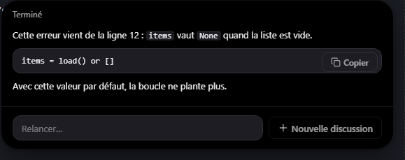
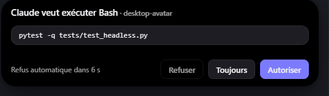
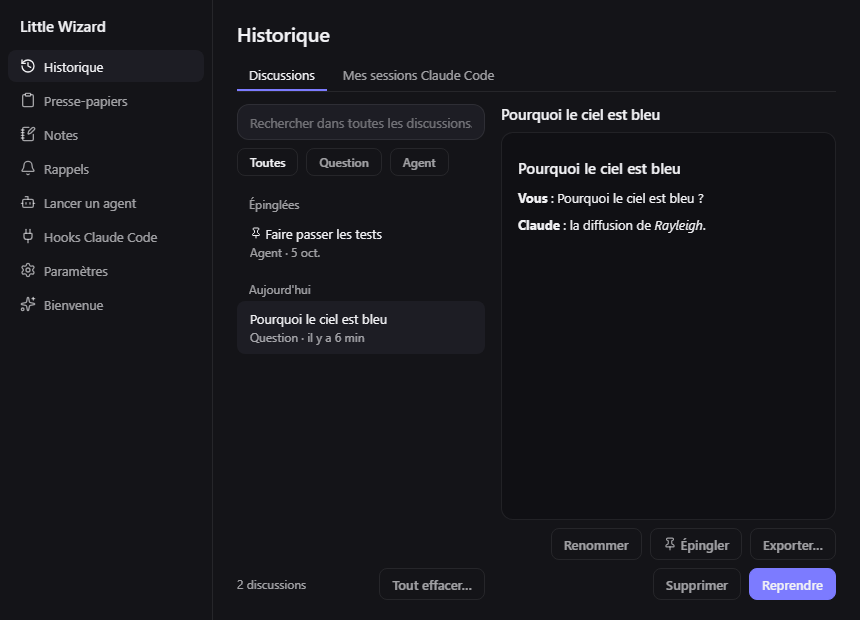

# Little Wizard

**A small wizard who lives above your Windows taskbar and puts Claude one
click away — about whatever is on your screen, without ever opening a
terminal.**

Show him a zone of your screen, a window or an image and ask your question: the
answer appears at the top of your screen, in a black island that grows out of
nothing. He can point at things for you, step by step. He also watches your own
Claude Code sessions, lets you approve their actions without switching windows,
and keeps your clipboard, notes and reminders at hand.

<p align="center">
  <br>
  
</p>

> **Open source, MIT licensed.** Windows 10 and 11. The interface is in
> **French** (the code and these docs are in English). It uses your existing
> Claude Code login: there is no API key and nothing billed on top.
>
> Little Wizard is an independent project. It is not made by, affiliated with
> or endorsed by Anthropic. "Claude" and "Claude Code" are Anthropic's.

---

## Contents

- [What it does](#what-it-does)
- [Install](#install)
- [Using it](#using-it)
- [Claude Code integration](#claude-code-integration)
- [Privacy and safety](#privacy-and-safety)
- [Configuration](#configuration)
- [How it is built](#how-it-is-built)
- [Development](#development)
- [Status and known limits](#status-and-known-limits)
- [Contributing](#contributing)
- [Credits](#credits)
- [License](#license)

## What it does

**Ask about your screen**
- Draw a zone, take the whole screen, `Ctrl`+drag the wizard onto a window, or
  drop an image on him, then ask. Every capture is shown to you **before** it
  can be sent.
- The answer streams into the island at the top of the screen, with code blocks
  you can copy in one click. The conversation continues until you start a new
  one, and every conversation is kept in a searchable history you can resume.

**Let Claude show you**
- Claude can point at a button, highlight an area or walk you through a task in
  steps (*Précédent / Suivant*): a small companion cursor flies from the
  wizard's staff to the spot. Escape clears it.

**Work with the text you selected**
- In any app: translate, rephrase, fix, summarise or explain the selection, then
  paste the result back in place or copy it. Your clipboard is restored after.

**Keep an eye on Claude Code**
- Your own Claude Code sessions (through hooks) and the background agents the
  wizard runs appear as one line each: what they are doing right now.
- Their permission requests come to you here: *Autoriser*, *Toujours* or
  *Refuser*. **Silence means no**: a request you do not answer is refused.
- The wizard's staff is the status light: gold at rest, blue while Claude
  works, amber when something waits for you.

**Everyday helpers**
- Clipboard history (text and images), quick notes, reminders (`25`, `1h30`, or
  in plain French: *rappel dans 20 min sortir le pain*), a launcher for your own
  apps and folders, and copying the text out of any zone of the screen with
  Windows' own OCR, on your machine.
- A command palette (`Ctrl+Alt+Space`, or `/` in the bar) that finds all of
  this by typing a few letters.
- A memory: a note of what Claude should know about you, sent with each
  question.

<p align="center">
  
</p>

## Install

### With the installer

1. Install and log in to **Claude Code**, which Little Wizard drives:
   ```powershell
   claude auth login
   claude auth status    # should say "loggedIn": true
   ```
2. Run `Little Wizard_<version>_x64-setup.exe` (built as described in
   [Development](#development)). It installs for your user only, with nothing
   else needed: no Python, Node or Rust.
3. The wizard appears above the taskbar and a welcome screen checks your
   machine: Claude Code login, hooks, tray icon.

> The installer is not signed yet: Windows SmartScreen will warn on first run
> (*More info → Run anyway*).

> **Windows 10 hides new tray icons** behind the `^` of the taskbar. You do not
> need it: right-click the wizard for the same menu.

### From source

Requirements: Windows 10/11, Python 3.11+ (tested on 3.14), Node 20+, Rust
(`rustup`, MSVC toolchain), and Claude Code logged in.

```powershell
git clone https://github.com/Kofi04/lutin.git
cd lutin
py -3.14 -m venv .venv
.venv\Scripts\python.exe -m pip install -e ".[dev]"
cd ui
npm install
npm run tauri dev       # starts the UI, which starts the Python core
```

## Using it

| Action | Default shortcut | Elsewhere |
|---|---|---|
| Ask Claude | `Ctrl+Alt+C` | click the wizard |
| Show a zone of the screen | `Ctrl+Alt+S` | *Zone* in the bar |
| Show the whole screen | `Ctrl+Alt+E` | *Écran* in the bar |
| Show a window | — | `Ctrl`+drag the wizard onto it |
| Show an image | — | drop the file on the wizard |
| Act on the selected text | `Ctrl+Alt+T` | *Sélection* in the bar |
| Copy the text in a zone (local OCR) | `Ctrl+Alt+O` | `/` → *Copier le texte d'une zone* |
| Command palette | `Ctrl+Alt+Space` | `/` in the bar |
| Quick note | `Ctrl+Alt+N` | menu → *Note rapide* |
| Clipboard history | `Ctrl+Alt+V` | menu → *Presse-papiers* |
| Show / hide the wizard | `Ctrl+Alt+A` | menu |
| History, reminders, agents, settings | — | menu (right-click the wizard) |

- **Click** the wizard to open the bar; **right-click** him for every option;
  **drag** him anywhere (he remembers where; *Replacer sur la barre* puts him
  back).
- **Escape** closes the bar, cancels a zone being drawn, and clears whatever
  Claude is pointing at.
- Every shortcut can be changed in *Paramètres → Raccourcis*: click the field and
  press the combination. Conflicts are caught before they are saved.

## Claude Code integration

Little Wizard drives Claude Code through the
[Claude Agent SDK](https://github.com/anthropics/claude-agent-sdk-python), with
the login you already have. One long-lived session answers your questions, so a
second question does not wait for a new process.

**Hooks (optional).** *Menu → Hooks Claude Code… → Installer…* adds Little
Wizard to `~/.claude/settings.json`, so that your own sessions show up and their
permission requests can be answered from the wizard. Before writing, it backs
the file up, merges instead of replacing (other tools' hooks are kept, in
place), and shows you the exact change. Uninstalling removes only its own
entries.

**Claude Code is never blocked by Little Wizard.** Observational events are
asynchronous; only the permission request waits, and if the wizard is closed,
crashed or slow, the hook exits quietly and Claude Code asks you in the terminal
as usual.

> Uninstalling the app? Remove the hooks first (*Hooks Claude Code… →
> Désinstaller…*), or they will point at a program that is gone (the app warns
> about this when it is still installed).

## Privacy and safety

Everything is stored **on your machine**, in `%APPDATA%\LittleWizard\`:
settings (`config.toml`), notes, clipboard history and conversation history
(`wizard.db`, SQLite, with a 256 px thumbnail of each capture — never the full
image), your memory note (`memory.md`).

**What leaves your machine** — only what you ask Claude, sent to Anthropic
through the Claude Code CLI you are signed in to: your question, the capture you
confirmed, your memory note, the selected text for a selection action, and an
agent's task and what it reads in the folder you chose. There is **no telemetry,
no analytics, no other server**.

- **No capture is sent without you seeing it first.** There is deliberately no
  setting to skip the preview.
- **Nothing is captured in the background.** Every capture starts from something
  you did.
- **Our windows are never in our captures** (they hide for the grab), and they
  can be hidden from screen sharing (Teams, Zoom, OBS) too:
  `ui.exclude_from_capture`, on by default.
- **Clipboard history keeps whatever you copy, passwords included.** Turn it
  off before copying secrets (*Paramètres → Système*), or set
  `clipboard.enabled = false`.
- **Claude never acts without asking.** Every action that changes something
  waits for your approval; read-only tools can be pre-approved in the settings.
- The UI and the core talk over a WebSocket bound to `127.0.0.1` only, with a
  random port, a secret token handed over at launch, and a check of the page's
  origin, so another program or web page on your machine cannot drive it.

## Configuration

Most settings are in *Paramètres* (right-click the wizard). Everything is in
`%APPDATA%\LittleWizard\config.toml`, commented in French; after editing it,
*menu → Recharger la configuration* applies it without a restart. A malformed
value falls back to its default and you are told what was ignored.

Launcher entries take anything the Windows Run dialog accepts:

```toml
[[launcher]]
label = "Projet"
target = "code"
args = ["C:\\Users\\me\\projects\\thing"]

[[launcher]]
label = "Téléchargements"
target = "shell:Downloads"
```

## How it is built

Two processes, one app:

- **The core** (Python, `src/wizard/`) has no window: global hotkeys, screen
  captures, Claude (Agent SDK), the Claude Code hook bridge (a named pipe), the
  SQLite data, local OCR.
- **The UI** (Tauri 2 + React + TypeScript, `ui/`) draws everything: the
  wizard (a 2D canvas), the island, the guide cursor (one transparent overlay
  per screen), the app window, the tray icon.

Tauri starts the core and keeps it alive; they speak one JSON protocol over a
local WebSocket, defined once in `src/wizard/protocol_messages.json` and checked
on both sides (the TypeScript types do not compile if they drift from it). The
hook Claude Code runs is a tiny standard-library script, frozen on its own in
the installer so it starts fast.

More: [DESIGN.md](DESIGN.md) (the interface, state by state, in French),
[docs/ENGINEERING.md](docs/ENGINEERING.md) (how each part works and what was
measured), [PLAN.md](PLAN.md) (the build plan and its history, in French).

## Development

```powershell
# Python core
.venv\Scripts\python.exe -m pytest
.venv\Scripts\python.exe -m ruff check src tests hooks packaging

# UI
cd ui
npm run check            # TypeScript, then the Vitest suite
npm run playground       # every window, in a browser, fed by a fake core
cd src-tauri
cargo test
```

**The playground** (`npm run playground`) shows the real windows in a browser,
driven by scenarios in `ui/src/playground/scenarios/*.json` (a streamed answer,
an approval running out, a 3-step guide, drawing a zone, a core crash…). No
Python, no Tauri: it is the quickest way to work on the interface.

**Building the installer:**

```powershell
.venv\Scripts\python.exe -m pip install -e ".[build]"   # PyInstaller
.venv\Scripts\python.exe packaging\build.py
# -> ui\src-tauri\target\release\bundle\nsis\Little Wizard_<version>_x64-setup.exe
```

The core and the hook are frozen with PyInstaller (`--onedir`) and shipped by
Tauri in a per-user NSIS installer (about 51 MB). On a machine with little
memory, the Rust release build is long: `build.py` compiles one crate at a time.

## Status and known limits

- **Windows only.** The core's modules import elsewhere so the tests run
  anywhere, but the app does not.
- **French interface only.**
- **Voice is not there yet.** The optional `[voice]` and `[live]` extras in
  `pyproject.toml` are reserved for it; nothing uses them today.
- **Reminders live in memory**: closing the app loses them (every reminder says
  so).
- **The animation while Claude works is not cheap**: about a quarter of one CPU
  core while a session is busy. At rest the whole app uses under 1 %.
- **No light theme**, and the installer is not code-signed.
- There is no CI yet: tests and linters are run by hand.

## Contributing

Issues and pull requests are welcome. Before a pull request:

- run both test suites and the linters above;
- keep the interface text in French and the code, comments and docs in English;
- colours, sizes and animations come from `ui/src/design/tokens.ts` only (a test
  fails otherwise);
- a change to the protocol goes in `protocol_messages.json`, with fixtures in
  `tests/protocol_fixtures.json`, tested from both sides.

## Credits

- The idea of a desktop companion for Claude Code comes from
  [coucou](https://github.com/louis-cfm/coucou) (macOS, MIT): its architecture
  and behaviours inspired this one. Its name, character, icon and sounds are its
  author's and are not used here.
- The flying guide cursor is inspired by
  [Clicky](https://github.com/farzaa/clicky) (MIT).
- Built with [Tauri](https://tauri.app), [React](https://react.dev),
  [Motion](https://motion.dev), [Lucide](https://lucide.dev) icons,
  [PySide6](https://doc.qt.io/qtforpython-6/) and the
  [Claude Agent SDK](https://github.com/anthropics/claude-agent-sdk-python).

## License

[MIT](LICENSE) © 2026 Kofi04
