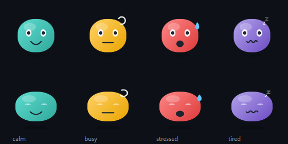

# Lutin

A small animated companion that floats just above the Windows taskbar, with a
tray icon, global hotkeys, clipboard history, quick notes and countdown
reminders. Its mood reflects what your machine is doing.



## Requirements

- Windows 10 or 11
- Python 3.11+ (tested on 3.14)
- PySide6 — the only runtime dependency

## Install

```powershell
py -3.14 -m venv .venv
.venv\Scripts\python.exe -m pip install -e ".[dev]"
powershell -ExecutionPolicy Bypass -File scripts\shortcut.ps1
```

The last line puts a **Lutin** icon on the Desktop and in the Start
Menu. Double-click it to launch — that is the whole story from then on. To keep
it one click away, right-click the Start Menu entry → *More* → *Pin to taskbar*.

`scripts\shortcut.ps1 -Remove` deletes both shortcuts again;
`-DesktopOnly` skips the Start Menu entry.

The shortcut points at `.venv\Scripts\lutin.exe`, the GUI launcher that
`pip install -e .` generates from the `[project.gui-scripts]` entry point. It is
a GUI-subsystem binary, so no console window ever appears. If you prefer the
command line, `.venv\Scripts\pythonw.exe -m lutin` does the same thing.

> **The shortcut hard-codes this folder.** Move or rename the project and the
> icon breaks — just re-run `scripts\shortcut.ps1` to point it at the new path.

> **Windows 10 hides new tray icons.** On first run the avatar's tray icon goes
> into the overflow area behind the `^` chevron. Drag it onto the taskbar, or
> use *Taskbar settings → Select which icons appear on the taskbar*, to keep it
> visible.

## What it does

> **The interface is in French; the code is in English.** Identifiers, comments,
> docstrings and this README stay English, as does anything the user never sees
> (the `Mood` values, config keys, hotkey modifier names). Everything displayed —
> menus, dialogs, notifications, the comments inside `config.default.toml` — is
> French. Strings are inline rather than routed through Qt's `tr()`, because the
> app targets one language and a `.ts`/`.qm` pipeline would be pure ceremony.

| Action | Hotkey | Menu entry |
|---|---|---|
| Quick note | `Ctrl+Alt+N` | *Note rapide* |
| Clipboard history | `Ctrl+Alt+V` | *Presse-papiers* (or a single tray click) |
| Launcher menu | `Ctrl+Alt+Space` | *Lancer* |
| Show / hide the avatar | `Ctrl+Alt+A` | *Masquer / Afficher le lutin* |
| Reminders | — | *Me rappeler…* |

- **Left-click the avatar** opens the full action menu; **drag it** to move it
  anywhere, and it remembers where you left it.
- **Clipboard history** records text copies into SQLite, skipping blanks and
  consecutive duplicates, pruned to `max_entries`. Select an entry and press
  Enter to put it back on the clipboard.
- **Moods** come from CPU, RAM and battery: calm → busy → stressed, plus a
  tired face when you are below `battery_low` on battery power.
- **Reminders** accept `25`, `25m`, `1h30`, `90s` or `25:00`, with presets
  including a 25-minute pomodoro.

## Configuration

Edit `%APPDATA%\Lutin\config.toml` (created on first run from
`src/lutin/config.default.toml`), then pick **Recharger la configuration** in the tray menu.
No restart needed, hotkeys included.

Launcher entries take anything the Run dialog accepts — an executable, a
document, a folder, a `shell:` moniker or a URL:

```toml
[[launcher]]
label = "Project"
target = "code"
args = ["C:\\Users\\me\\projects\\thing"]

[[launcher]]
label = "Downloads"
target = "shell:Downloads"
```

A malformed file never blocks startup: bad values fall back to defaults and the
app reports what it ignored in a tray notification.

## Data and privacy

Everything stays on your machine, in `%APPDATA%\Lutin\`:

- `config.toml` — your settings
- `lutin.db` — notes and clipboard history (SQLite)
- `state.ini` — the avatar's last position

Nothing is sent anywhere, and there is no network code in this project. Since
clipboard history captures whatever you copy — passwords included — turn
**Enregistrer le presse-papiers** off in the tray menu before copying secrets, or set
`clipboard.enabled = false`.

*Lancer au démarrage de Windows* writes one `HKCU\...\CurrentVersion\Run` value and removes
it when you untick it. Nothing else touches the registry.

## Tests

```powershell
.venv\Scripts\python.exe -m pytest
```

The suite covers the logic that is worth protecting and does not need a
display: config parsing and clamping, SQLite behaviour (dedup, pruning, LIKE
escaping), the mood thresholds, and the hotkey/duration parsers.

## The icon

`src/lutin/app.ico` is generated, not hand-drawn — it comes from the same
`draw_avatar` code as the running avatar:

```powershell
.venv\Scripts\python.exe tools\make_icon.py
```

Re-run it after changing `sprite.py`, then re-run `scripts\shortcut.ps1` so the
shell picks up the new file. It writes nine sizes (16 to 256) because Windows
picks a different one per context, and below 32px it enlarges the eyes and
thickens the mouth — at 16px the default proportions blur into the body.

## Packaging

```powershell
.venv\Scripts\pyinstaller.exe --noconsole --onefile --name Lutin ^
  --icon src\lutin\app.ico ^
  --add-data "src\lutin\config.default.toml;lutin" ^
  --add-data "src\lutin\app.ico;lutin" ^
  --paths src ^
  src\lutin\__main__.py
```

`--icon` sets the icon baked into the .exe; the second `--add-data` ships the
same file inside the bundle so `app_icon()` still finds it at runtime for the
dialogs. Point `scripts\shortcut.ps1` at `dist\Lutin.exe` afterwards, or
just make a shortcut to it by hand — a packaged build needs no virtualenv.

## Architecture

```
src/lutin/
  branding.py       the app name and every identifier derived from it
  app.ico           the app icon, generated by tools/make_icon.py
  winapi.py         ctypes wrappers: taskbar, CPU/RAM/battery, hotkeys, autostart
  config.py         TOML loading with defaults and clamping
  storage.py        SQLite: notes + clipboard history
  sprite.py         the avatar, drawn with QPainter (no image assets)
  avatar_window.py  the frameless translucent always-on-top window
  hotkeys.py        RegisterHotKey bridged into Qt via a native event filter
  tray.py           tray icon and menu
  ui.py             quick note, history panel, reminder dialog
  app.py            wiring only: who talks to whom
  features/         launcher, clipboard watcher, monitor, timers
scripts/
  shortcut.ps1      creates/removes the Desktop and Start Menu shortcuts
tools/
  make_icon.py      renders sprite.py into a multi-resolution app.ico
```

Two decisions worth knowing about:

- **Placement uses Qt, not Win32.** `QScreen.availableGeometry()` already
  reports the area the taskbar left free, in logical pixels and DPI-correct.
  `SHAppBarMessage` is only consulted for the auto-hide flag, which Qt does not
  expose.
- **Global hotkeys need a native event filter.** `RegisterHotKey` posts
  `WM_HOTKEY` to a window's message queue, and Qt owns that queue, so
  `QAbstractNativeEventFilter` is the supported place to intercept it. A
  never-shown widget owns the registrations so hotkeys survive hiding the
  avatar.

## Known limits

- Windows only. The modules import cleanly elsewhere (the Win32 calls degrade to
  neutral values) so the tests run anywhere, but the app itself does not.
- Reminders live in memory: they do not survive a restart, by design.
- Clipboard history is text only — images and files are ignored.
- The avatar is always-on-top, so it can cover a corner of a window underneath.
  Drag it somewhere else, or hide it with `Ctrl+Alt+A`.
